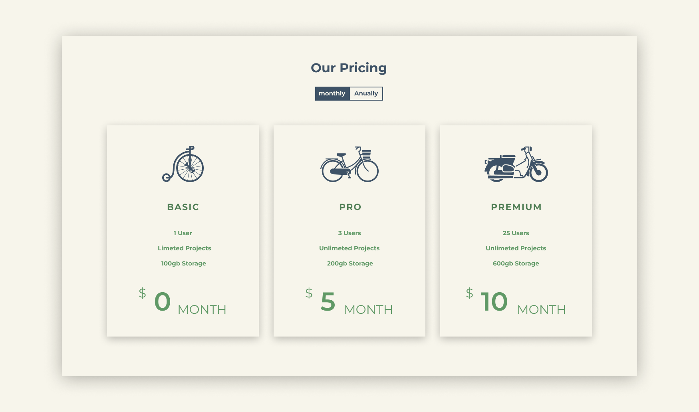

# Pricing Components

- Projeto de página web desenvolvido utilizando HTML, CSS, JavaScript e a biblioteca **[ScrollReveal](https://scrollrevealjs.org/)** para animação de elementos na página.
- A página apresenta uma seção composta por 3 cards com diferentes planos de assinatura mensais, e um botão de alternância que muda os preços nos cards para planos anuais.

[Link da página](https://jonassjr.github.io/Pricing-Component/)
